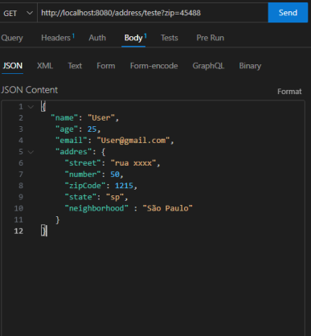

#  Criação de uma API em JAVA Spring boot

[link do projeto no discord](https://discord.com/channels/713050127270674442/1110238354173349939)

---

Desenvolver uma API em Java Spring boot utilizando: 
* Spring web
* JPA
* h2
* Lombok (opcional) 
* DevTools nas dependências do Maven.

Para este desafio, você deve desenvolver uma API Rest para cadastra clientes que irá receber os 4 tipos de verbos HTTP sendo eles o GET, POST, PUT e DELETE. A API deverá ser as seguintes regras :

* GET -> /customers ele deverá retornar uma lista com todos os clientes cadastrados 

* GET -> /customers?zipCode=15548 deverá retornar uma lista de clientes que moram neste CEP em especifico.

* GET -> /customers?id=1 deverá buscar o usuário por Id usando RequestParams 

* GET -> /address deverá retornar todos os endereços cadastrados 

* GET -> /address?id = 1 deverá retornar o endereço por Id

* GET -> /address?zipCode deverá retornar o endereço por CEP

* Post -> Deve receber o seguinte DTO e ser inserido no banco de dados :

` 
    {
        "name": "User",
            "age": 25,
            "email": "User@gmail.com",
            "addres": {
            "street": "rua xxxx",
            "number": 50,
            "zipCode": 1215,
            "state": "sp",
            "neighborhood" : "São Paulo"
            }
    } `

Perceba que dentro do DTO tem um outro objeto chamado ADDRESS, ele armazena o endereço do usuário e salva em uma tabela chamada Address dentro do H2.

Esse relacionamento é 1 - 1 ONETOONE 

---

* PUT -> Deve receber o DTO atualizado junto com o ID a ser atualizado na base de dados 
/customer?di=2 

* DELET -> Deve receber o id do cliente que deverá ser deletado

---

Para todos os casos retornar 

200 ok - created
202 ok - no content - casos de delete
400 erro ao encontrar um usuário 
404 bad request 

sendo o retorno do erro HTTP da seguinte forma 

(status , mensagem de erro)

Os serviços deverão estar utilizando o padrão S.O.L.I.D, mas especificamente apenas os padrões de Single Responsability e Interaface Sergregation

