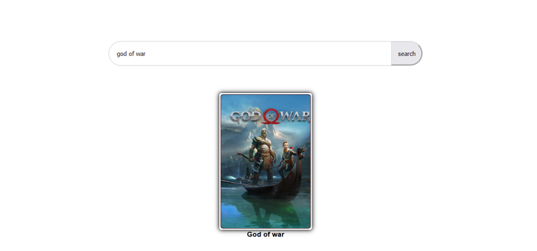
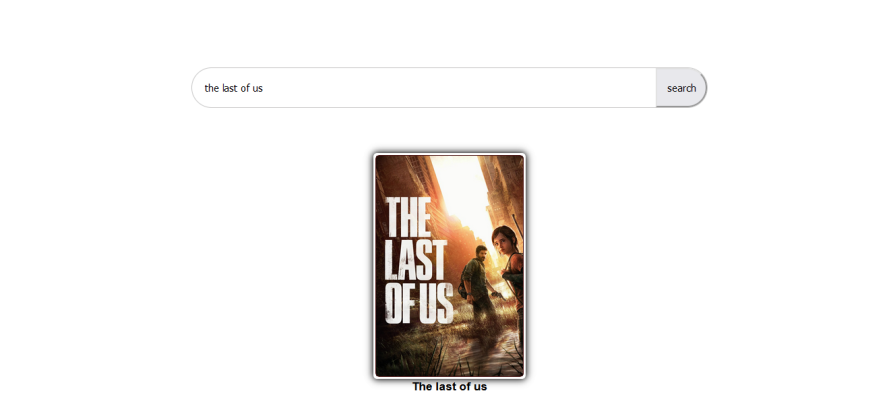
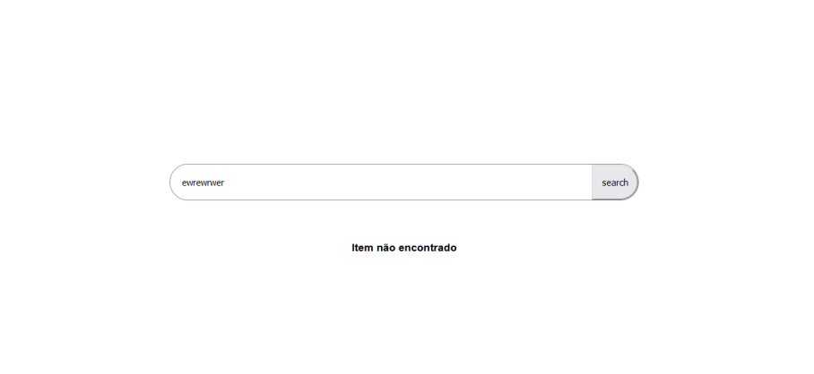

# Sistema de busca de jogos

[Link do desafio no discord ]( https://discord.com/channels/713050127270674442/1104579755992420514)

---
Neste desafio vocês vão ter que desenvolver um sistema de busca de jogos utilizando HTML, CSS e JavaScript. 

A tela deve ser um input de busca aonde ao digitar um nome de um jogo, a foto e o nome do jogo devem aparecer. Para isso vocês devem consumir uma API utilizando o Fetch. 
O servidor da API deve ser feito utilizando json-server. 

* Deve aceitar nomes maiúsculos ou minúsculos
    
* Deve ter um arquivo CSS estilizando o card

* Deve utilizar o fetch para buscar os dados e filtrar

---

Abaixo é possível ver a documentação do NPM do Json-server:

https://www.npmjs.com/package/json-server

O Json server funciona a base de um arquivo json que ele fica olhando. Quando fazemos um Get ele retorna todos os dados, como também podemos passar o Id, fazer Post, Put e Delete. 

Para facilitar, estou disponibilizando o Json logo abaixo :

Basta copiar e colar, em um arquivo chamado db.json 

no arquivo package json fazer a seguinte modificação : 

Isso server para que ao iniciar o npm start o Json-server levante o servidor na porta 3001 com os dados 

`
"scripts": 
{
    "start": "json-server --watch db.json --port 3001"
}
`

👇 👇 👇 👇 👇 👇 👇 👇 👇 👇 👇 👇 👇 
👇 

https://drive.google.com/file/d/1m-aODPeqLB-lmQQr6xlXxj86CVqTLPte/view?usp=sharing

