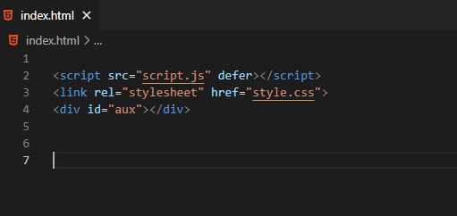
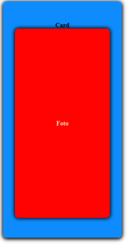

## Challenge : Gerar um card apenas com JavaScript 

[link do desafio no discord ](https://discord.com/channels/713050127270674442/1101149013937504406)

O desafio consiste  em gerar um elemento html através do de um código JavaScript. 

O único HTML que você pode utilizar é este de modelo : 

Você deve gerar uma página com 2 elementos:

* Card

    * Foto do card

Esses dois elementos devem ser uma div com as classes "card" e "photo".

Você deverá centralizar os elementos utilizando flex box e fazer com que a div aux implemente eles dentro dela utilizando JavaScript. 

