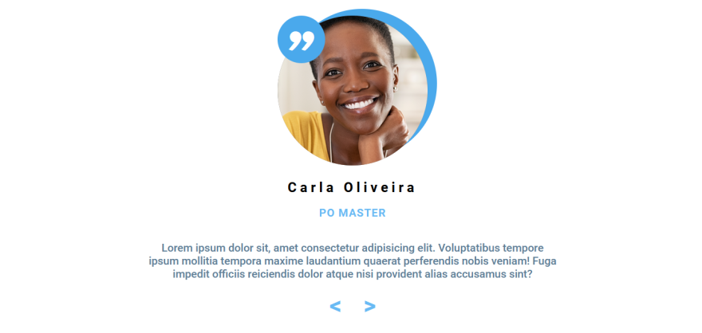
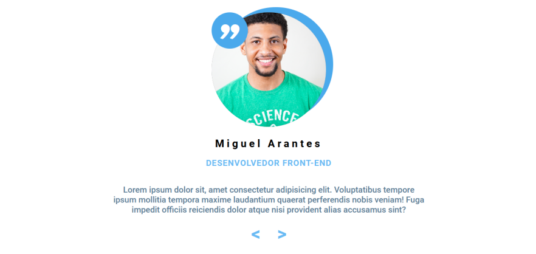
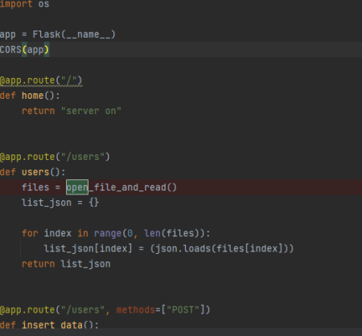
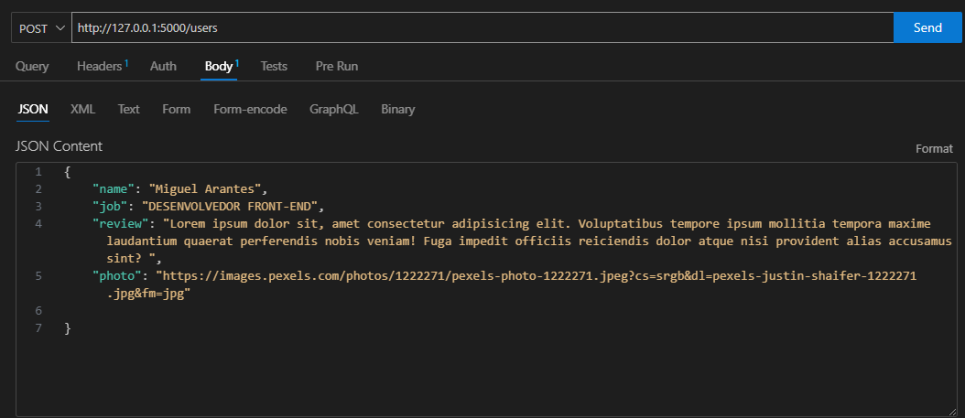
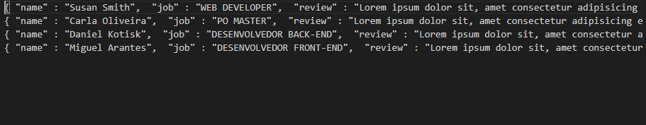

# CARROSSEL DE REVIEW - FULL-STACK

[Link do projeto no discord](https://discord.com/channels/713050127270674442/1107999066228527144)

---

Neste projeto você irá mexer com:

    HTML
    CSS
    Flex Box
    Manipulação da DOM via JavaScript
    Requisição GET e POST
    Trabalhar com leitura e escrita de arquivos
    CORS
    BACK END
    Tratamento de dados e Strings

Criar uma página de review que altera entre os funcionários de uma empresa. O carrossel deve mostrar as seguintes informações:

    Foto
    Nome
    Cargo
    Review

Também deve haver 3 botões sendo duas setas para alterar a posição do índex na lista do carrossel e um terceiro botão chamado "Surprise Me", onde ele vai trazer um review aleatório

## **Back-end**

---

API - Coloquei um exemplo da minha api feita em Python, porém você pode usar o Json Server, Spring boot ou outro framework para fazer a API. 

    Ao bater em url/users a API deve retornar uma lista de usuários que será consumida pelo front. 

---

O back deverá receber via POST os dados no formato JSON como mostra a imagem e também retornar a lista completa com todos os dados caso seja feito um GET. 

Neste caso não é possível fazer a exclusão ou atualização, apenas inserir e recuperar dados. 

Exemplo de json a ser enviado para o Back e recebido via GET :

    {
        "name": "Miguel Arantes",
        "job": "DESENVOLVEDOR FRONT-END",
        "review": "Lorem ipsum dolor sit, amet consectetur adipisicing elit. Voluptatibus tempore ipsum mollitia tempora maxime laudantium quaerat perferendis nobis veniam! Fuga impedit officiis reiciendis dolor atque nisi provident alias accusamus sint? ",
        "photo": "https://images.pexels.com/photos/1222271/pexels-photo-1222271.jpeg?cs=srgb&dl=pexels-justin-shaifer-1222271.jpg&fm=jpg"

    }

### **DADOS** :
---

Os dados NÃO devem ser salvos (persistidos) em uma banco de dados relacional ou não relacional. Neste caso vamos utilizar arquivos para guardar os dados, toda vez que um dado for salvo via POST, deve-se salva-lo no arquivo data.json ou data.txt. Ao fazer um GET, deve-se retornar todos os valores que existirem neste arquivo. 

