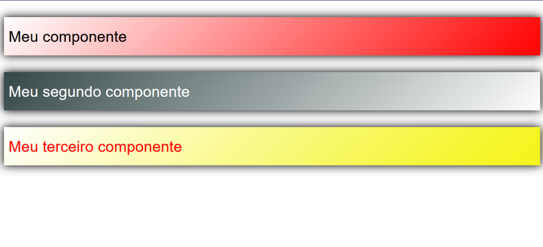
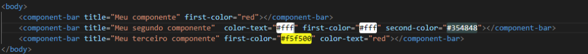

# CRIAÇÃO DE COMPONENTS JAVASCRIPT

Neste desafio você deve criar um component da sua preferência em javaScript puro. 
Esse desafio será importante para entender DOM, SHADOW DOM e VIRTUAL DOM. 

Crie um component header utilizando JavaScript Vanilla para receber os seguintes parâmetros:

* color-text
* first-color (back-ground)
* second-color (back-ground)
* title

A renderização deve ser semelhante a mostrada na imagem. 

Utilize o HTMLelement para criar o component como mostrado na imagem. 

